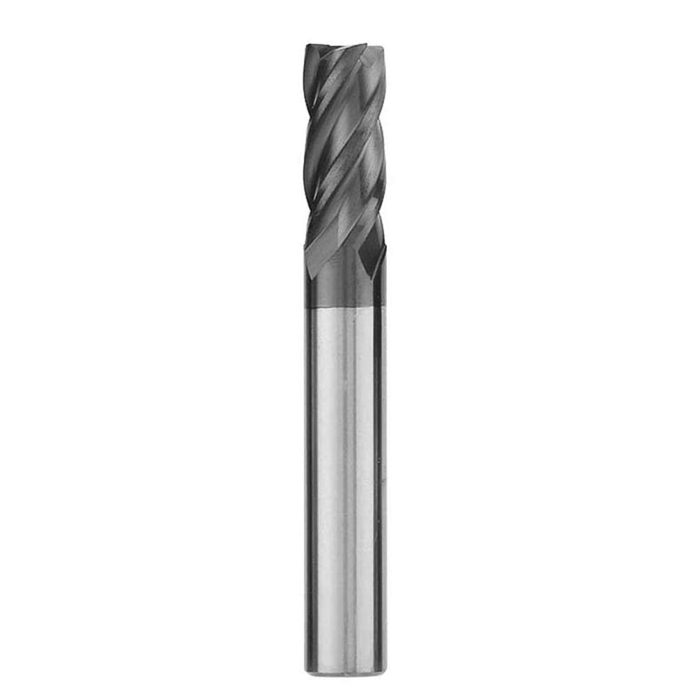

# Math and the forces
In this section, I'll be going over some of the math behind the gantry-mill design.

## Overview and variables
The main function of cesiumNC is going to be milling, cutting things with a cylindrical cutting tool. Those cylindrical cutting tools are called  **endmills.** They look like this:

These little bits are what allow a machine to cut almost whatever material you throw at them. They come with a variety of different shapes and sizes, some with flat ends and some rounded. Each of those blades that helix around the center of the bit are what cut material. In practice, endmills are spun by a powerful spindle and pushed through material. As the blades spin, they slice off a small amount of material.

This is the fundamental concept around how CNC milling works. Spindle spins the bit, axes move the endmill into the workpiece. There are many variables at play when milling happens: spindle speed, spindle strength, the speed at which the endmill feeds into material (**feedrate**), the percentage of the endmill that's cutting(**engagement**), the hardness of the material. These variables not all cut and dry. The relationships between them need to be balanced, otherwise a variety of failures could happen.

- Endmill blades can become overloaded if they're cutting too much material per revolution. If the machine feeds material too quickly into the endmill, the endmill's blades can wear out quickly or it may shatter entirely.  
- The more material the blades are cutting, the more strength it takes to spin the spindle. If the spindle is not strong enough to spin the endmill, it might not be able to keep up.

And finally, the most important factor, **chatter.**
People getting started with engineering will quickly come to realize that everything bends. Steel, concrete, granite, you name it. To some extent, it can flex. 

This concept we call rigidity can be the bane of many machines. When an endmill pushes against material, the structure holding the spindle might flex a certain amount depending on the design and the amount of force on the endmill. If the structure flexes too much, the endmill can deflect away from the material, vibrating back and forth against what it's cutting. This can cause severe damage or wear to the machine, spindle, and endmill, and leave rough and imprecise edges on the material.

The final variable we need to balance out, affected by everything mentioned above, is the amount of force that the spindle will need to withstand to cut at acceptable speeds.

## Equations

Let's define the inputs first. These will be adjusted to find good balances.
- Spindle speed(rpm)
- Feedrate(inches per minute)
- Material hardness (K-factor, higher materials are softer)
- Cutter engagement
- Endmill cutter count (flutes)

The first thing we'll need to get is the volume of material being removed per minute, or **Material Removal Rate.** This is the product of the endmill's radial engagement (width of cut, horizontally), axial engagement (depth of cut, vertically), and feedrate.
$$MRR=Radial*Axial*Feedrate$$

MRR can be turned into spindle load (amount of horsepower required) by simply dividing by MRR by the K-factor.

$$SpindleLoad=\frac{MRR}{K}$$
The only issue with this equation is that spindle load is divided by the endmill's flute count. For example, if I increase the flute count from one to two flutes, the chips are half as large and take half as much force. To complete the equation, let's divide by the flute count, but to be safe I like to determine things by assuming only one flute.  It's also good practice to divide this by .9 as no spindle motors are perfectly efficient.
$$SpindleLoad=\frac{\frac{\frac{MRR}{K}}{0.9}}{Flutes}$$

If we wanted to, we could also get spindle load in percentage by dividing this by a given spindle's horsepower rating.

$$LoadPercentage=\frac{SpindleLoad}{HPrating}$$

Great, so now we have spindle load in horsepower. Next thing that's needed is to calculate the amount of force being exerted onto the endmill as we cut this material.

Since we already have the load in horsepower, we just need a bit of conversion to turn that into tool force. Multiplying HP by 63025 gives us torque in in-lb, then all that needs to be done is divide that by the tool radius and spindle speed. The final equation for tool force looks like this:

$$ToolForce=\frac{SpindleLoad\cdot63025}{Radius\cdot SpindleSpeed}$$

And that's it! I spent a few days and slapped all these equations into desmos with a few extra things to help me calculate and play with variables:

### [desmos.com](https://www.desmos.com/calculator/9l1ayhgbim)

sources:

[ame.com](https://www.ame.com/workholding-wisdom-posts/2021/03/01/cutting-forces-in-milling/)

[mscdirect.com](https://www1.mscdirect.com/images/solutions/kennametal/millingTechInfoFormulas.pdf)

[mmsonline.com](https://www.mmsonline.com/articles/a-new-milling-101-milling-forces-and-formulas)

## Making conclusions
So what does this all mean? By looking at the graph, as RPM increases, tool forces and spindle load decrease. **From this, it can be concluded that a higher spindle speed can reduce tool forces substantially.** This is apparent in DATRON machines, which use a high speed spindle to [move the endmill quickly through materials](https://youtu.be/3YzAl29Ag78?t=109).

Since I don't intend on cutting anything harder than aluminum on this machine or any ferrrous metals, a high speed spindle shouldn't have drawbacks due to tool wear with the [right high speed endmills.](ttps://www.datron.com/shop-cnc-tools/product-category/end-mills/)

After playing with the desmos inputs, I've determined that I can get some high speed ratios that exert a max of ~18LB on the spindle. 